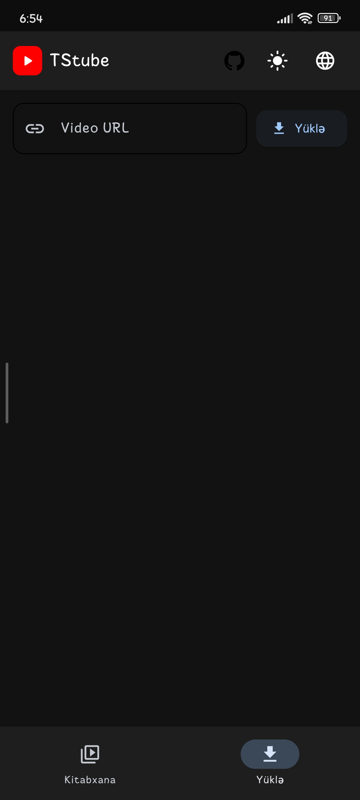
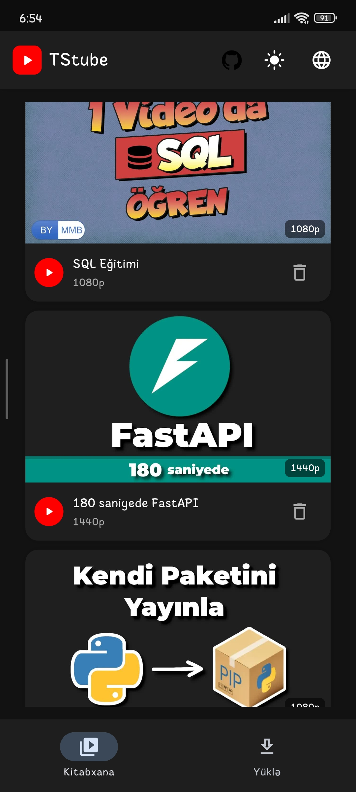

# TStube 🎬📱

**TStube** — istifadəçilərə istənilən videonu müxtəlif keyfiyyətlərdə (4K, 1080p, 720p və s.) asanlıqla yükləməyə və tətbiq daxilində quraşdırılmış xüsusi pleyerdə izləməyə imkan verən müasir çarpaz platformalı tətbiqdir. Python proqramlaşdırma dili və **Flet** UI freymvorku istifadə olunaraq hazırlanıb.

---

## 📱 Android-də Quraşdırma və Yükləmə (APK)

Tətbiqi Android telefonunuza yükləyib quraşdırmaq üçün aşağıdakı addımları izləyə bilərsiniz:

1. Bu səhifənin sağ panelində yerləşən **Releases** (Buraxılışlar) bölməsinə daxil olun.
2. Ən son versiyaya aid olan **`TStube.apk`** faylını telefonunuza endirin.
3. Fayla klikləyərək quraşdırmanı başladın (Əgər xəbərdarlıq gələrsə, naməlum mənbələrdən yükləməyə icazə verin).
4. Quraşdırma bitdikdən sonra tətbiqi açıb istifadə edə bilərsiniz!

---

## ✨ Əsas Xüsusiyyətlər

* **📥 Çeşidli Video Yükləmə:** İstədiyiniz video keçidini daxil edərək mövcud keyfiyyətləri avtomatik yoxlaya və istədiyiniz keyfiyyətlə yükləyə bilərsiniz.
* **▶️ Qabaqcıl Video Pleyeri:** İki dəfə toxunmaqla irəli/geri sarıma, səs və sürətləndirmə kimi funksiyaları dəstəkləyən daxili pleyer.
* **🔄 Qaldığın Yerdən Davam Et:** Videonu yarıda bağlasanız belə, tətbiq son baxdığınız nöqtəni avtomatik yadda saxlayır və növbəti dəfə həmin yerdən davam edir.
* **📂 Kitabxana İdarəetməsi:** Yüklənmiş videolarınızı bir yerdə görün, başlıqlarına və keyfiyyətlərinə baxın və ya istədiyiniz zaman silin.
* **🌍 Çoxdilli Dəstək:** Azərbaycan, İngilis, Türk, Rus, Ərəb, İspan, Fransız, Alman və Portuqal dilləri dəstəklənir.
* **🌓 Mövzu (Theme) Seçimləri:** Zövqünüzə görə Qaranlıq (Dark) və İşıqlı (Light) rejimlər arasında keçid edin.

---

## 🛠️ İstifadə Olunan Texnologiyalar

* **Python**
* **Flet & Flet Video** (İstifadəçi interfeysi və media idarəetməsi üçün)
* **Asyncio** (Asinxron proseslər və axınların idarə olunması üçün)

---

*Layihə `testere-development` tərəfindən idarə olunur.*
